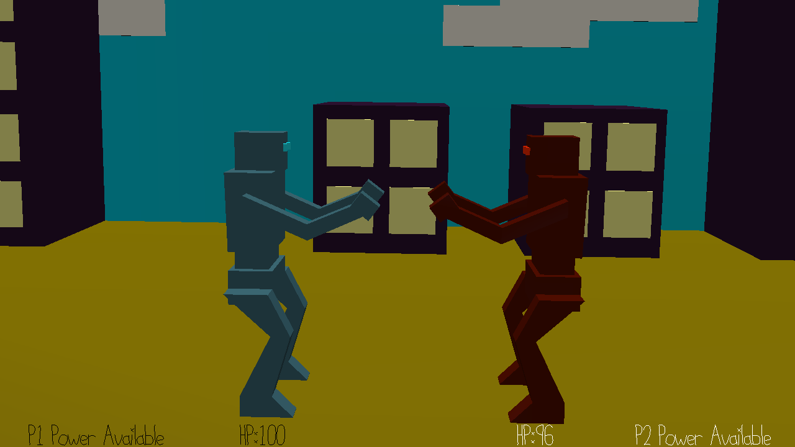

# Rakshasa Defence

Author: Rakshit Tikoo

Design: The game is a 2-player rhythm game. Player 1 acts as the Robot defending the city, and Player 2 acts as the Monster (Rakshasa) trying to destroy the city. Now there is an honor method among the robots and monsters, that they would always fight to a music beat. Hence, each player would see keys showing up at top of their head at the beat of the song currently playing, and they need to hit it to successfully attack or defend. If both players hit simultaneously, their attacks cancel out. 
The health of each player is seen at the bottom of the screen, and one player has to successfully deplete the other player's health. Other than the basic attacks, there is a power up available to each player, which when enabled, doubles the attack of the player who activated it (though it could still be canceled out by the other player), with the cavaet being, it makes the game faster and more difficult to play. Who can match the beats of the game best and win? 

Screen Shot:

How To Play:

The keys appear on top of each player's head, and they need to be pressed exactly. Mis-clicks, prevents the correct key from getting pressed. The health for each player is seen at the bottom of the screen. The power up is available to both players and it is activated using different buttons. Once activated, it stays on for a while, and then it switches back to normal mode. It later recharges back over time. 

Keys to play with : 

W,A,S,D - Player 1 Rhythm Keys

Spacebar - Player 1 Power Enable

Left, Right, Up, Down Arrow Keys - Player 2 Rhythm Keys

"/" Key - Player 2 Power Enable

This game was built with [NEST](NEST.md).
